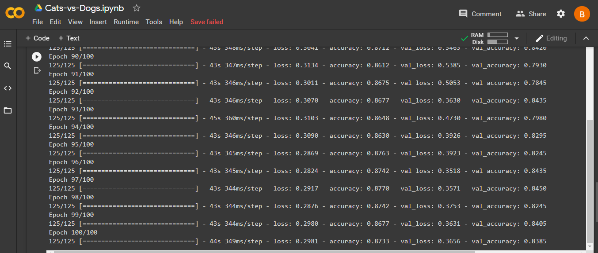
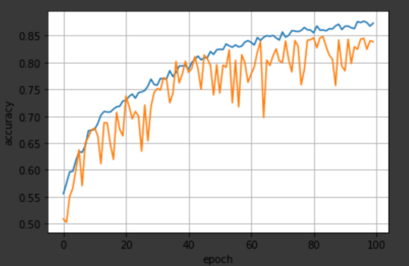

# Cats-vs-Dogs-Classification-using-Image-Augmentation  
I use the dataset available on kaggle to classify either the picture is of cat or dog. The link to dataset is https://www.kaggle.com/c/dogs-vs-cats/data  .  
There are total 37500 picutres (including training and testing images).   
But here i used 7000 of them and applied image augmentation feature to get an idea of image augmentation working. i splitted the data as : 4000 images for training(2000 for cats ,2000 for dogs), 2000 for validation(1000 of cats , 1000 of dogs) and 1000 for testing.  
The images are of different sizes but while using Imagedatagenerator , i rescaled them to 150x150.Few of sample images are given above in the file section.  
I made use of 3 Con2D layers,3 MaxPooling2D layers,3 Dense layers, 3 Batchnormalization layers and 2 Dropout layers.I have also attached my model's file in above files section.  
I trained the model till 100 epochs.Validation accuracy reached upto 84%. Result is shown in figure below.    
The graph of accuracy and number of epochs is plotted below.Blue curve is for training accuracy while the orange curve is for validation accuracy.    
